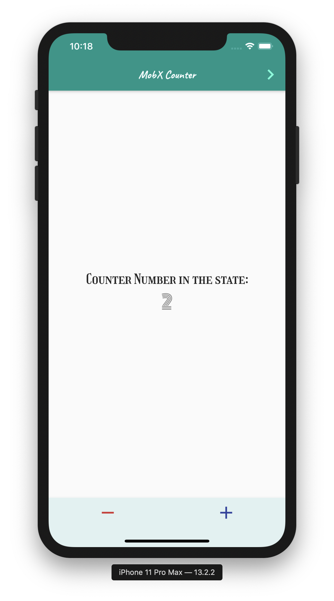
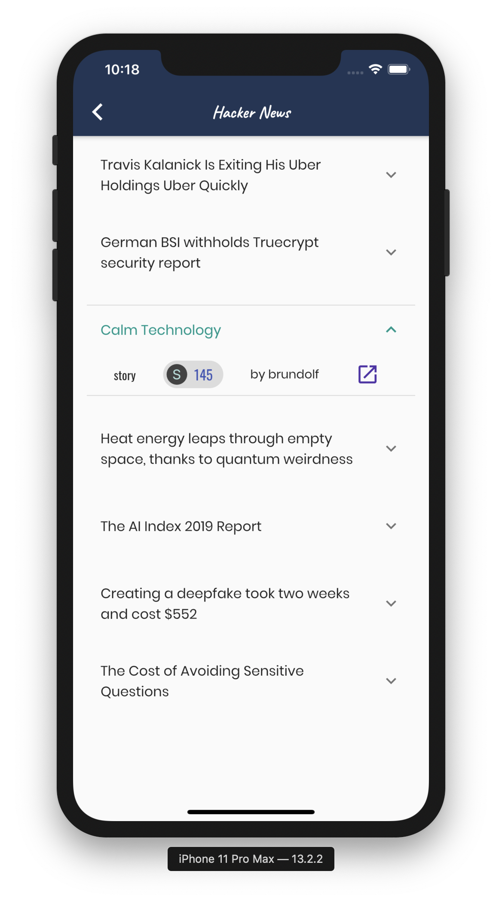

# fl_cau

A sample Flutter project to demonstrate state management with **mobX**.

Following stores are provided in the lib/store folder which are generated with **mobx_codegen**.
- $Counter: counter.g.dart
- $HackerNews: hacker_news.g.dart

Also, instead of **http** package, **chopper** is used to call the hacker news api. Check out for the generated NewsService with **chopper_generator.**

- $NewsService: news_service.chopper.dart

## Get Started

To run, git clone this project first, then

(From the command line)
> - $ cd fl_cau
> - $ flutter packages get
> - $ flutter packages pub run build_runner build

(For the ios simulator)
> - $ flutter emulators --launch apple_ios_simulator
> - $ flutter run -d iPhone

## Screenshots

| Counter                               | Hacker News                           |
| ------------------------------------- | ------------------------------------- |
|  |  |

